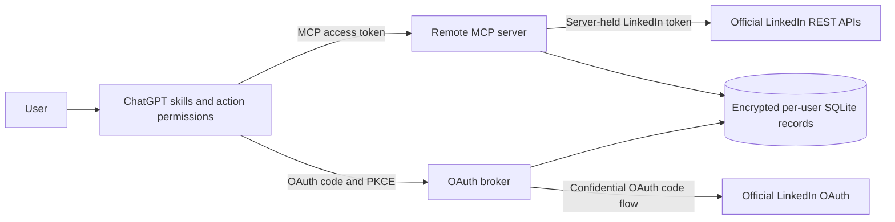

# LinkedIn Copilot for ChatGPT architecture

Decision record: 2026-09-10. Written after inspecting the original eleven skills,
the hook catalog, profile rubric, Python writing helpers, voice template, and
Claude manifests, and reviewing current official OpenAI and LinkedIn documentation.

## Two layers

1. `skills/linkedin-*` contains eleven focused natural-language workflows and a
   router. These preserve the original writing methods without slash commands,
   Claude home-directory state, or automatic external actions. Skills work with
   user-supplied material even when the connected app is unavailable.
2. `src/` implements a remote Streamable HTTP MCP server using the official
   TypeScript SDK, Express, Node.js 24 and a persistent SQLite database. OAuth,
   authorization, provider calls, encrypted context, and write audit records live
   here. No OpenAI API key is needed: ChatGPT supplies the reasoning.

## Packaging and discovery

Use the current portable root `plugin.json` and `mcp.json` format, plus a
`.codex-plugin/plugin.json` compatibility manifest and generated connected-app
mapping when a real OpenAI app ID exists. These are OpenAI's documented packaging
formats, not renamed Claude manifests. No account or marketplace is modified by
building the repository. Package all twelve skills; do not advertise the draft
MCP skill-import extension, whose current scan limit is five skills.

Sources: [packaging](https://developers.openai.com/plugins/build/plugins),
[skills](https://developers.openai.com/plugins/build/skills),
[MCP server and skill import](https://developers.openai.com/plugins/build/mcp-server).

## Installation and conversational onboarding

The repository includes a GitHub marketplace at `.agents/plugins/marketplace.json`.
Version 2.1 defaults to a skills-only package with empty MCP configuration; no
localhost process is required to install the writing workflows. A registered-app
bundle uses a canonical `asdk_app_`, `connector_`, or `templated_apps_` mapping.
An explicit `--url` produces the separate desktop MCP development bundle.

The server exposes two anonymous, read-only help tools. `linkedin_get_copilot_guide`
reports this product's workflows and configured catalog without checking an account.
`linkedin_get_workflow` reads a fixed allowlist of canonical skill files and JSON
references, allowing ChatGPT to apply the workflow in the current conversation.
These tools do not install skills, save preferences or call LinkedIn. Docker includes
the same `skills/` library used by the native package. All existing account tools
retain their independent authentication and authorization checks.

## Authentication and data boundaries

ChatGPT authenticates to this server using a preconfigured OAuth client,
authorization code flow, mandatory S256 PKCE, exact redirect allowlists, and a
resource-bound short-lived opaque access token. Discovery metadata and HTTP 401
challenges identify the OAuth endpoints. Client credentials and PKCE verifiers
never enter skill prompts. The broker separately redirects to LinkedIn's official
confidential OAuth flow, validates one-use state tied to the initiating browser,
and stores the resulting provider credentials using AES-256-GCM encryption.

LinkedIn identity comes from authenticated OIDC UserInfo. Every database operation
and tool uses that identity from the verified broker token; callers cannot supply
another user's ID or posting actor. Token records, authorization codes, local
context, and receipts persist across restarts. SQLite is a deliberate single-node
deployment choice: one process, one durable volume. Horizontal scaling requires a
shared transactional store and rate limiter before increasing replicas.

Request `openid profile` initially; request configured write/read scopes only when
the corresponding broker permission is authorized. Refresh LinkedIn tokens only
when LinkedIn actually issues a supported refresh token for the approved app.
Otherwise reconnect on expiry. Disconnect invalidates broker credentials and
deletes local LinkedIn credentials and saved context. It must honestly distinguish
local disconnection from LinkedIn-side grant removal in Permitted Services.

Sources: [OpenAI OAuth](https://developers.openai.com/plugins/build/auth),
[LinkedIn authorization](https://learn.microsoft.com/en-us/linkedin/shared/authentication/authorization-code-flow),
[LinkedIn refresh](https://learn.microsoft.com/en-us/linkedin/shared/authentication/programmatic-refresh-tokens).

## Capability contract

`docs/LINKEDIN_API_MATRIX.md` is the source of truth for product access and
permissions. Expose implemented capabilities only when operator configuration
declares the relevant approved LinkedIn scope; enforce the user's granted scopes
again at execution. Environment flags cannot grant provider API access.

- Baseline: connection status, basic own OIDC profile, read/update isolated user
  context. Text post creation with `w_member_social` when enabled.
- Restricted: own recent posts, own post retrieval (`r_member_social`, currently
  closed to new applicants); comments/replies (`*_member_social_feed` under the
  documented current Comments API); own post analytics (`r_member_postAnalytics`).
- Delete: only a post whose ownership can be established from a server receipt or
  an authorized provider read. Caller-supplied ownership is never sufficient.
- Absent tools: arbitrary profile lookup, feed search, notifications, inbox,
  message sending, connection automation, and profile updates. Skills accept
  pasted/exported content and produce manual-use drafts for those features.

## External actions

Drafting does not publish. Each publishing/comment/reply/deletion tool exposes the
exact content and target as schema arguments for ChatGPT's review UI. Write tools
carry `readOnlyHint: false`, `openWorldHint: true`, and appropriate destructive and
idempotency annotations, plus per-tool OAuth security schemes. ChatGPT controls
the actual approval policy; a model-supplied `approved: true` is not evidence of
approval and is not used. The server independently checks scope, ownership,
validated targets and configured capability before making the provider call.

Use a per-user client request ID for mutating LinkedIn calls. Persist a payload
hash and an in-flight marker before sending; a replay returns the stored receipt,
changed payloads are rejected, and uncertain network outcomes remain blocked
from automatic retry until the user reconciles the external result. Audit logs
contain tool, actor hash, request ID, target, outcome and time, never credentials
or full post/message bodies. All provider content is untrusted data, including
instructions embedded in posts or comments.

## Persistent voice

`user-profile/{voice,audience,positioning,content-pillars,banned-phrases,goals}.md`
are blank source templates, never live multi-user storage. The app exposes
`linkedin_get_user_context` and `linkedin_update_user_context` to save those six
sections encrypted under the authenticated user. Explicitly requested saved
preferences persist; inferred preferences need user review. Skills never change
immutable packaged logic to personalize the user.

## Operational and verification requirements

HTTPS reverse proxy, exact origin/host checks, request limits, rate limits,
credential-redacted logging, timeout/error normalization, health/readiness checks,
graceful shutdown, non-root Docker runtime and durable encrypted storage. Secrets
come from deployment configuration. Automated tests cover schemas, routing (at
least 30 prompts), OAuth/PKCE/replay, expiry, isolation, permissions, mocked
LinkedIn reads/writes, error handling and write annotations. Live LinkedIn and
ChatGPT checks require operator credentials, product grants and an eligible
workspace; mocked tests do not establish marketplace acceptance.
