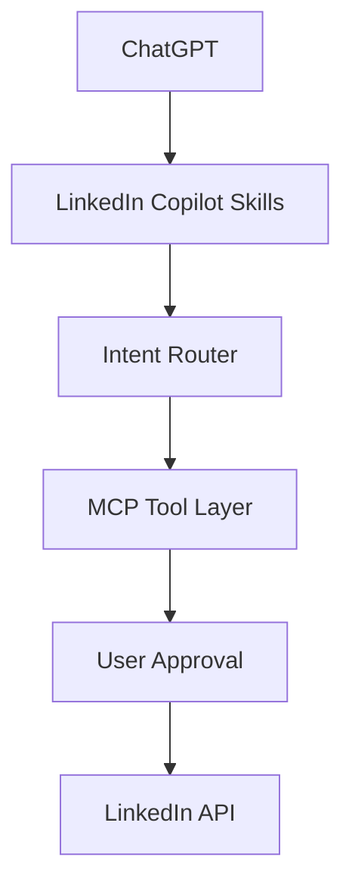

# LinkedIn Copilot for ChatGPT

**Your AI-powered LinkedIn content, engagement and growth agent — built natively for ChatGPT.**

Built and maintained by **Muhammad Anas**

[LinkedIn Profile](https://www.linkedin.com/in/muhammad-anas-a35b1a334/) · [GitHub Repository](https://github.com/yo-its-anas/linkedin-copilot-chatgpt) · [Available Skills](#available-skills) · [Installation](#installation)

**Install once. Start with a draft. Keep working in the same chat.**

> "Write a post about my latest DevOps project."
>
> "Make it sound more like me."
>
> "Turn it into a carousel and plan the rest of my week."

LinkedIn Copilot brings reusable skills and an optional connected app together in ChatGPT. You describe the outcome; Copilot picks the relevant workflow. Connect LinkedIn when you need supported account data or actions, and review external writes through ChatGPT's permissions.

**Using ChatGPT web?** Start with [Web setup](docs/WEB_SETUP.md). If search shows "No plugins match", this project has not been published to the directory yet. Pushing this repository does not create a public ChatGPT listing.

| Where you use ChatGPT | Supported route |
| --- | --- |
| Web with a skills-upload option under Create | Build the web bundle and follow the displayed upload/install flow |
| Web with an MCP URL form under Create | Connect a deployed Copilot MCP endpoint; a GitHub URL is not an MCP endpoint |
| Web workspace with admin import | Import the repository marketplace and enable the plugin for your role |
| Public web directory | Submit the plugin, obtain approval, then publish it |
| Desktop local Work | Add the repository marketplace through the plugin creator |

The web skills bundle contains all twelve workflows and no server configuration. The skills can use an already connected LinkedIn tool when it supports the requested operation. Copilot's own MCP tools require its separately hosted app and OAuth. Connecting a search-only LinkedIn plugin does not add post analytics.

## Using your connected LinkedIn

Copilot now checks tools already available in the chat before asking for a separate
connection. If a connected tool can read your posts and metrics, the audit skill
can use it. A people-search tool cannot fetch private post analytics, regardless
of how many writing skills are installed.

For hosts that install a repository as one local skill, the root `SKILL.md` now
provides a single Copilot entry point with all twelve workflows. The native
plugin continues to expose the twelve individual skills. Loading workflow
instructions does not require compiling TypeScript or starting the MCP server.
[Downloaded vs active skills, and connector troubleshooting](docs/INSTALLATION.md#downloaded-repository-vs-active-skills).

## Overview

LinkedIn Copilot transforms ChatGPT into a connected LinkedIn assistant for content, engagement and growth workflows. It helps you analyze your presence, improve your writing, plan what to publish and use supported LinkedIn actions through an OAuth-connected MCP server.

Drafting and analysis work with material you supply. Live account access depends on the official APIs and permissions available to your LinkedIn developer application. This repository contains the implementation and deployment structure; it is not an already hosted service or an approved Plugin Directory listing.

## Why I Built This

I built this ChatGPT-native redesign to bring LinkedIn writing, planning and engagement into one conversational workflow. I wanted to move from an idea to a useful draft, review the result and take a supported action without losing the context behind it.

My interests in DevOps, cloud infrastructure and software engineering shape how I approach AI-powered engineering workflows and agentic systems. Useful agents need more than prompts: they need clear permissions, reliable integrations, testable behavior and a practical path to deployment. LinkedIn Copilot is my application of those principles to a focused, everyday workflow.

— **Muhammad Anas**

## Features

- **Analyze your LinkedIn presence:** assess supplied profile content and identify focused improvements.
- **Audit posts and performance:** use supplied posts and metrics, or authorized API data when available.
- **Generate high-quality posts:** develop hooks and complete drafts grounded in your experience and voice.
- **Create weekly content strategies:** organize themes, angles, posting plans and engagement priorities.
- **Humanize AI-generated writing:** improve clarity, specificity and rhythm with optional editorial helpers.
- **Create carousel content:** outline slides and copy; rendered artifacts depend on available rendering tools.
- **Repurpose long-form content:** turn articles, notes and transcripts into distinct LinkedIn ideas.
- **Draft comments and replies:** contribute relevant observations and respond in context.
- **Manage engagement workflows:** prioritize responses and prepare follow-up drafts.
- **Analyze inbox conversations:** triage conversations you paste or supply; live inbox access is not implemented.
- **Perform supported actions:** publish text posts, comment, reply or delete your own posts when API access and all authorization requirements are satisfied.

Installed skills are managed by ChatGPT, not stored by this app in ChatGPT memory. Saved preferences are separate from skill instructions. The packaged `user-profile/` files are blank templates, and the humanizer's style heuristics are not an AI-authorship detector.

## Architecture



ChatGPT interprets the request and applies the appropriate skills. The intent router coordinates workflows; the MCP server handles OAuth, tool schemas, permissions and official API calls. The approval step represents ChatGPT's host-controlled review for external actions. Drafting and reading have their own appropriate permission requirements.

The server uses TypeScript, Node.js 24, the official MCP SDK and Express. OAuth credentials and user context are stored in encrypted SQLite. Provider tokens stay on the server and are never returned to the model. Write receipts help prevent duplicate actions. The server does not require an OpenAI API key.

See [the detailed architecture](ARCHITECTURE.md) and [migration guide](MIGRATION.md).

## Available Skills

| Skill | Purpose |
| --- | --- |
| `linkedin-post` | Generate hooks and a complete post draft |
| `linkedin-plan` | Build a weekly content and engagement plan |
| `linkedin-audit` | Analyze content and available performance evidence |
| `linkedin-profile` | Apply a 100-point profile rubric to supplied content |
| `linkedin-humanize` | Edit for natural, specific writing |
| `linkedin-carousel` | Develop a slide sequence and carousel copy |
| `linkedin-repurpose` | Extract reusable angles from long-form material |
| `linkedin-comment` | Draft specific, useful comments |
| `linkedin-reply` | Triage comments and prepare replies |
| `linkedin-dm` | Draft outbound messages for manual sending |
| `linkedin-inbox` | Analyze and triage supplied conversations |
| `linkedin-router` | Coordinate natural-language, multi-skill requests |

## Example Conversations

> "What skills does LinkedIn Copilot have?"

Copilot explains its eleven focused workflows and router. If its MCP app is available, the public guide reports configured tools; an account check establishes which live requests may be possible. This does not claim that every configured feature has been authorized.

> “Write a LinkedIn post about what I learned deploying a Kubernetes application. Ask me for the details you need.”

> “Here are my last 20 posts and their metrics. Audit what worked and plan next week.”

> “Rewrite this draft in my voice. Keep the technical details and remove generic claims.”

> “Turn this article into a seven-slide LinkedIn carousel.”

> “Here are three inbox conversations. Prioritize them and draft thoughtful replies.”

> “Publish this exact final draft with public visibility.”

The final request uses an external write tool only if the connected account has the required capabilities and ChatGPT's approval requirements are satisfied. Asking to write a draft does not authorize publishing.

## LinkedIn Integration

The MCP server connects through OAuth to official LinkedIn APIs. Start with **Sign In with LinkedIn using OpenID Connect** and `openid profile` for basic connected identity. Additional features require their own products, scopes and, where applicable, LinkedIn approval.

1. Create a LinkedIn developer app and store its credentials server-side.
2. Register `https://YOUR-HOST/oauth/linkedin/callback` as the LinkedIn callback.
3. Configure a separate OAuth client for ChatGPT, using the exact callback displayed by its app setup.
4. Enable only LinkedIn scopes your developer application actually holds.
5. Reconnect after changing requested permissions and test each enabled capability.

**Publishing has an additional identity requirement.** This implementation resolves a verified Person ID through `/v2/me` with an existing `r_liteprofile` or approved `r_basicprofile` grant. It does not assume an OIDC subject is a Person ID. A new self-service OIDC + Share app may therefore be unable to publish with this implementation, even with `w_member_social`.

Full historical reads, analytics and comments require separate grants. There is no live personal inbox, DM sending, profile editing, arbitrary profile search, media upload or scheduled publishing implementation. Those skills use supplied material and prepare drafts for manual use.

## User Approval & Safety

External LinkedIn actions execute only when all four conditions hold:

1. **LinkedIn officially exposes the required API.**
2. **The user has authenticated.**
3. **The required permissions and scopes are available.**
4. **ChatGPT's approval requirements are satisfied.**

Skills present the exact content, target and visibility for review. ChatGPT controls approval prompts; tool annotations are not proof of approval. The server independently enforces account identity, scopes, input validation and ownership checks. It does not accept a model-generated `approved: true` flag as authorization.

OAuth uses state, CSRF protection and PKCE on the ChatGPT-to-server flow. Credentials are encrypted at rest, and repeated action IDs return stored receipts. Uncertain write outcomes block automatic retries pending reconciliation.

Disconnecting deletes local credentials and preferences and invalidates broker access. Removing provider authorization is a separate action in LinkedIn's Permitted Services. Read [Security](SECURITY.md) and [Permissions](docs/PERMISSIONS.md).

## Installation

### ChatGPT web

Build the dedicated skills bundle:

```sh
npm ci --ignore-scripts
npm run package:web
```

The ZIP appears at `release/web-*/linkedin-copilot-chatgpt.zip`. If **Plugins > Create** offers skill or plugin uploads, follow that flow. If it asks for an MCP server URL, it is the connection path and cannot accept a repository URL or skill ZIP.

For public discoverability, use the [OpenAI plugin portal](https://platform.openai.com/plugins), choose **Create plugin > Skills only**, and upload the bundle. Public search requires approval and publication; a portal draft alone is not a public listing. [Official submission guide](https://developers.openai.com/plugins/deploy/submission).

[Web setup and prepared listing copy](docs/WEB_SETUP.md) explain the remaining account-side steps. The package has not yet been installed or validated in your web account.

### ChatGPT Work / desktop

In local desktop Work with the built-in plugin creator, use:

```text
@plugin-creator Add yo-its-anas/linkedin-copilot-chatgpt as a plugin marketplace
and help me install LinkedIn Copilot for ChatGPT.
```

This desktop setup prompt does not publish a web plugin. Where the Codex CLI is available, the equivalent marketplace command is:

```sh
codex plugin marketplace add yo-its-anas/linkedin-copilot-chatgpt --ref main
```

Then install **LinkedIn Copilot for ChatGPT** from that source in the desktop plugin browser and open a new chat. The install prompt requires an available installer and host confirmation. [Official marketplace setup](https://developers.openai.com/plugins/build/plugins).

### ChatGPT workspace

An admin can import this repository through **Admin > Plugins > Add > Import marketplace**, using the repository URL, an empty Path and `main` as the branch. Members install the imported plugin once it is made available to their role. Importing a catalog does not connect anyone's LinkedIn account. [Official workspace import](https://learn.chatgpt.com/docs/enterprise/plugin-management).

### Optional connected actions

The maintainer deploys the included MCP server and registers it as an app. Users then connect that **Copilot** app through OAuth. The registered app can expose the workflow library and supported action tools in the same conversation; private actions retain their authentication and permission checks.

Build the default skills bundle or map an existing registered app:

```sh
npm run package:plugin
npm run package:plugin -- --app-id asdk_app_YOUR_ID
```

Use the actual app ID, not its plugin listing ID. The packager also accepts a `plugin_asdk_app_...` listing ID and normalizes it to `asdk_app_...`. Registered-app bundles avoid duplicate bundled MCP declarations. A raw `--url` bundle is available for desktop development.

See [the complete installation guide](docs/INSTALLATION.md) for the operator steps and current hosting prerequisites. The generated ZIP is under `release/` and excludes credentials, databases, dependencies and caches.

## Local Development

Contributors and self-hosting operators need Node.js **24.x** and npm:

```sh
git clone https://github.com/yo-its-anas/linkedin-copilot-chatgpt.git
cd linkedin-copilot-chatgpt
npm ci --ignore-scripts
```

Copy the example environment file. In PowerShell:

```powershell
Copy-Item .env.example .env
node -e "console.log(require('node:crypto').randomBytes(32).toString('base64'))"
```

Run the random-value command twice: use independent values for `ENCRYPTION_KEY` and `MCP_CLIENT_SECRET`. Fill in your LinkedIn credentials and the exact ChatGPT OAuth callback. The LinkedIn client secret and MCP client secret are separate credentials.

```sh
npm run dev
```

`GET /health` checks the process, `/ready` checks storage and `POST /mcp` serves stateless Streamable HTTP. OAuth discovery is exposed at `/.well-known/oauth-authorization-server` and `/.well-known/oauth-protected-resource`. Anonymous discovery is supported; private tool calls require account linking. GET and DELETE `/mcp` return 405.

ChatGPT needs a reachable HTTPS endpoint. When using a tunnel or reverse proxy, update `PUBLIC_URL`, `ALLOWED_ORIGINS` and the LinkedIn callback to the public origin. Preserve the public Host header.

## Deployment

Set production environment values and provide HTTPS through a reverse proxy, then run:

```sh
docker compose up --build -d
```

The container runs as a non-root user and persists encrypted SQLite on a named volume. The host port binds to loopback. Use **one process and one replica**; horizontal scaling requires shared transactional storage and distributed coordination.

Production candidate packaging requires the real endpoint, registered app ID, publisher and public policy URLs:

```sh
npm run package:plugin -- --production --url https://YOUR-HOST/mcp --app-id asdk_app_YOUR_ID --publisher "Muhammad Anas" --website https://YOUR-HOST --privacy https://YOUR-HOST/privacy --terms https://YOUR-HOST/terms
```

Replace these illustrative values with your deployed service details. Packaging creates a review candidate; it does not deploy, submit or publish the app. Live OAuth, LinkedIn grants and ChatGPT approval behavior must be validated before release. See [deployment operations](docs/DEPLOYMENT.md).

## Environment Variables

| Variable | Purpose |
| --- | --- |
| `NODE_ENV` | `development` locally; `production` when deployed |
| `PORT` | HTTP port; example uses `3000` |
| `PUBLIC_URL` | Externally reachable server origin |
| `DATABASE_PATH` | Persistent SQLite path |
| `ENCRYPTION_KEY` | Base64-encoded random 32-byte encryption key |
| `MCP_CLIENT_ID` | Preconfigured ChatGPT OAuth client identifier |
| `MCP_CLIENT_SECRET` | Independent random broker client secret, at least 32 characters |
| `MCP_REDIRECT_URIS` | Comma-separated exact allowed ChatGPT OAuth callbacks |
| `LINKEDIN_CLIENT_ID` | LinkedIn developer app client ID |
| `LINKEDIN_CLIENT_SECRET` | LinkedIn developer app client secret |
| `LINKEDIN_SCOPES` | Granted provider scopes; baseline `openid profile` |
| `LINKEDIN_API_VERSION` | Configured REST API version; example uses `202608` |
| `ALLOWED_ORIGINS` | Comma-separated allowed request origins |

Use [.env.example](.env.example) as the reference. Never commit `.env`, tokens or encryption keys. Configuration cannot grant permissions that LinkedIn has not approved.

## Testing

Automated checks also cover public workflow access, rejection of arbitrary file paths, and skills-only, registered-app and desktop MCP packages.

```sh
npm run check
python -m unittest discover -s tests -p "test_*.py"
```

The checks compile TypeScript, run automated tests and validate plugin packaging. Tests cover OAuth, scopes, encrypted storage, tenant isolation, write receipts, ownership, MCP transport and routing. Python tests cover optional writing helpers. LinkedIn responses are mocked; these tests do not publish posts or establish live API approval.

For account-specific OAuth and host approval checks, follow the [live testing guide](docs/CHATGPT_TESTING.md). The deterministic routing helper is a regression aid; actual ChatGPT skill selection also needs testing in the host.

## API Compatibility Matrix

Two public MCP tools support onboarding without LinkedIn login: `linkedin_get_copilot_guide` explains the product and configured tool catalog; `linkedin_get_workflow` supplies canonical workflow instructions and reference data. ChatGPT uses those instructions to draft in the current chat. These tools do not install skills or perform external actions.

| Capability | Required access | Implementation |
| --- | --- | --- |
| Basic connected profile | `openid profile` | Supported |
| Own post history and text | `r_member_social`, closed to new grants | Conditional |
| Read comments | `r_member_social_feed` | Conditional |
| Own post metrics | `r_member_postAnalytics` | Conditional |
| Publish/delete own text posts | `w_member_social` and verified Person ID | Conditional; deletion verifies ownership |
| Comment and reply | `w_member_social_feed` and verified Person ID | Conditional |
| Saved writing preferences | Authenticated app context permissions | Supported |
| Full profile audit | User-supplied profile content | Analysis and suggested edits |
| Personal inbox and DMs | User-supplied conversations | Triage and drafts; no live read/send |
| Media upload, reactions, scheduling | No implemented adapter | Unavailable |

Broker scopes (`linkedin:read`, `linkedin:write`, `context:write`) apply in addition to provider grants. See the [full API compatibility matrix](docs/LINKEDIN_API_MATRIX.md) for endpoint details, official sources, version assumptions and product restrictions.

## Roadmap

- Validate OAuth and approved capabilities against a designated live LinkedIn app.
- Expand real ChatGPT skill-selection and approval evaluations.
- Improve carousel artifact generation with available rendering tools.
- Add shared storage and distributed coordination before supporting multiple replicas.
- Evaluate additional official API capabilities only where access and permissions permit.
- Prepare public deployment, support resources and directory submission evidence.

These are planned improvements, not currently available services or promised API access.

## Contributing

Issues and pull requests are welcome in [the repository](https://github.com/yo-its-anas/linkedin-copilot-chatgpt). Describe the problem, expected behavior and relevant API access without including account credentials or private messages.

Keep changes focused, preserve attribution and run the checks above. Integration changes should reference official LinkedIn documentation and include meaningful permission and failure-path tests. Document any new environment settings or deployment requirements.

## License

Licensed under the [MIT License](LICENSE). Portions derived from the upstream project retain:

> Copyright (c) 2026 Jake Schincariol

The ChatGPT-native redesign and additional work are documented as:

> Modifications and additional work Copyright (c) 2026 Muhammad Anas

Both notices and the MIT permission notice must remain with applicable copies and substantial portions.

## Author

### Muhammad Anas

**DevOps Engineer | Cloud & AI Automation | Agentic Systems**

Creator and maintainer of the ChatGPT-native redesign.

LinkedIn:  
[https://www.linkedin.com/in/muhammad-anas-a35b1a334/](https://www.linkedin.com/in/muhammad-anas-a35b1a334/)

GitHub:  
[yo-its-anas](https://github.com/yo-its-anas) · [linkedin-copilot-chatgpt](https://github.com/yo-its-anas/linkedin-copilot-chatgpt)

If you find the project useful, consider starring the repository.

## Credits

LinkedIn Copilot for ChatGPT is a substantial ChatGPT-native redesign and extension of the open-source [`linkedin-agent-skill`](https://github.com/Jakeschincariol/linkedin-agent-skill) project originally created by **[Jake Schincariol](https://github.com/Jakeschincariol)**.

The redesigned project introduces ChatGPT-native skill orchestration, MCP architecture, OAuth-based LinkedIn connectivity, permission-aware actions, expanded documentation, testing and production deployment structure.

The upstream hook catalog, profile rubric, writing frameworks and humanizer methods form part of this project's foundation. Jake Schincariol's original copyright notice is retained under the MIT License.
